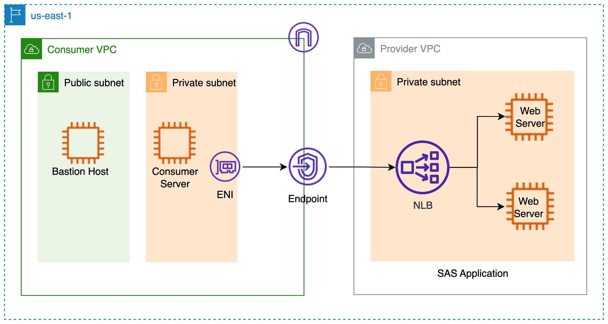

# terraform-aws-budget-mudule
This is a sample code to play around and learn AWS Private Links.

## Architecture


## Usage
```hcl
module "key-pair" {
  source       = "./key-pair"
  ec2_key_name = "private-link-poc"
}

module "vpc" {
  for_each = var.vpc_configs

  source                  = "git::https://github.com/rajdeep617/terraform-aws-vpc-module.git"
  azs                     = each.value.azs
  create_internet_gateway = each.value.create_internet_gateway
  create_nat_gateway      = each.value.create_nat_gateway
  create_private_subnets  = each.value.create_private_subnets
  create_public_subnets   = each.value.create_public_subnets
  name_tag                = each.value.name_tag
  vpc_cidr                = each.value.cidr
}

module "provider-ec2" {
  source                      = "./ec2"
  associate_public_ip_address = var.provider_ec2_config.associate_public_ip_address
  ingress_rules               = var.provider_ec2_config.ingress_rules
  instance_count              = var.provider_ec2_config.instance_count
  name_tag                    = var.provider_ec2_config.name_tag
  ec2_key_name                = module.key-pair.key_name
  ec2_private_key             = module.key-pair.ec2_private_key
  subnet_id                   = module.vpc["provider_vpc"].private_subnets_ids
  vpc_id                      = module.vpc["provider_vpc"].vpc_id
}

module "provider-nlb" {
  source       = "./nlb"
  instance_ids = module.provider-ec2.instance_ids
  name_tag     = var.provider_nlb.name_tag
  internal_nlb = var.provider_nlb.internal_nlb
  subnet_ids   = module.vpc["provider_vpc"].private_subnets_ids
  vpc_id       = module.vpc["provider_vpc"].vpc_id
}

module "consumer-ec2" {
  for_each = var.consumer_ec2_config

  source                      = "./ec2"
  associate_public_ip_address = each.value.associate_public_ip_address
  ingress_rules               = each.value.ingress_rules
  instance_count              = each.value.instance_count
  name_tag                    = each.value.name_tag
  ec2_key_name                = module.key-pair.key_name
  ec2_private_key             = module.key-pair.ec2_private_key
  subnet_id                   = each.key == "bastion" ? module.vpc["consumer_vpc"].public_subnets_ids : module.vpc["consumer_vpc"].private_subnets_ids
  vpc_id                      = module.vpc["consumer_vpc"].vpc_id
}

module "endpoint" {
  source = "./private-link"
  network_load_balancer_arns = [module.provider-nlb.nlb_arn]
  vpc_id                     = module.vpc["consumer_vpc"].vpc_id
  cidr_block = module.vpc["consumer_vpc"].vpc_cidr
  name_tag   = "endpoint"
  subnet_ids = module.vpc["consumer_vpc"].private_subnets_ids
}
```

## Examples
Refer to the [examples](https://github.com/rajdeep617/terraform-aws-private-link/tree/master/examples) directory in this GitHub repository for complete terraform code example.

## Known issues

No known issues.

## Requirements

| Name | Version  |
|------|----------|
| <a name="requirement_terraform"></a> [terraform](#requirement\_terraform) | >= 1.0.0 |
| <a name="requirement_aws"></a> [aws](#requirement\_aws) | >= 3.29  |

## Providers

| Name | Version |
|------|---------|
| <a name="provider_aws"></a> [aws](#provider\_aws) | >= 4.0  |

## Modules

| Name                                                              | Source                                                 | Version |
|-------------------------------------------------------------------|--------------------------------------------------------|---------|
| <a name="modules_vpc"></a> [vpc](#modules\_vpc)                   | https://github.com/rajdeep617/terraform-aws-vpc-module | n/a|
| <a name="modules_ec2"></a> [ec2](#modules\_ec2)                   | ./ec2                                                  |n/a|
| <a name="modules_key-pair"></a> [key-pair](#modules\_key-pair)    | ./key-pair                                             |n/a|
| <a name="modules_nlb"></a> [nlb](#modules\_nlb)                   | ./nlb                                                  |n/a|
| <a name="modules_private-link"></a> [private-link](#modules\_private-link) |./private-link|n/a|


## Inputs
| Name                                                                                                                | Description                               | Type                                                                                                                                                                                                                                                                                                 | Default | Required |
|---------------------------------------------------------------------------------------------------------------------|-------------------------------------------|------------------------------------------------------------------------------------------------------------------------------------------------------------------------------------------------------------------------------------------------------------------------------------------------------|-----|:--------:|
| <a name="vpc_configs"></a> [vpc\_configs](#vpc\_configs)                                                            | A map of VPC configuration                | <pre>map(object({<br> azs = list(string) <br> create_internet_gateway = bool<br> create_nat_gateway = bool <br> create_private_subnets = bool <br> create_public_subnets = bool <br> enable_dns_hostnames = bool <br> enable_dns_support = bool<br> name_tag = string<br> cidr = string<br>}))</pre> |     |   Yes    |
| <a name="provider_ec2_config"></a> [provider\_ec2\_config](#provider\_ec2\_config)                                  | EC2 properties for provider VPC           | <pre>object({<br> associate_public_ip_address = bool <br> instance_count = number <br> name_tag = string <br> ingress_rules = map(object({ <br>  from_port  = number <br>  to_port    = number <br>  protocol   = string <br>  cidr_block = list(string) <br> })) <br>}) </pre>                      |     |   Yes    |
| <a name="consumer_ec2_config"></a> [consumer\_ec2\_config](#consumer\_ec2\_config)                                  | A map of EC2 properties for consumer VPC  | <pre>map(object({<br> associate_public_ip_address = bool <br> instance_count = number <br> name_tag = string <br> ingress_rules = map(object({ <br>  from_port  = number <br>  to_port    = number <br>  protocol   = string <br>  cidr_block = list(string) <br> })) <br>})) </pre>                 |     |   Yes    |
| <a name="provider_nlb"></a> [provider'_nlb](#provider\_nlb)                                                         | NLB properties for provider VPC           | <pre> type = object({<br>  name_tag = string <br>  internal_nlb = bool <br> })</pre>                                                                                                                                                                                                                 |     |   Yes    |


## Outputs

| Name                                                                                         | Description                |
|----------------------------------------------------------------------------------------------|----------------------------|
| <a name="output_nlb_dns"></a> [nlb\_dns](#output\_nlb\_dnss)                                 | Network Load balancer ARN  |
| <a name="provider_ec2_ips"></a> [provider\_ec2\_ips](#output\_provider\_ec2\_ips)            | Provider EC2 Private IPs   |
| <a name="consumer\_ec2\_ip"></a> [consumer\_ec2\_ip](#output\_consumer\_ec2\_ip)             | Consumer EC2 private IP    |
| <a name="consumer\_bastion\_ip"></a> [consumer\_bastion\_ip](#output\_consumer\_bastion\_ip) | Consumer Bastion Public IP |

## Authors
Module managed by [Rajdeep Hayer](https://github.com/rajdeep617).